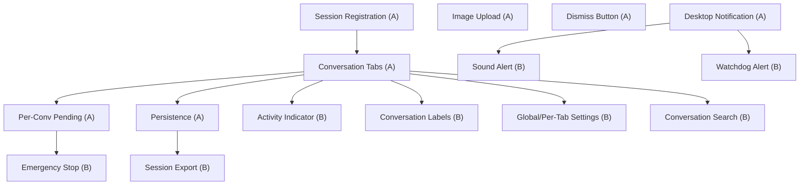

# MCP Feedback Enhanced - PRD v2.0

> [Chinese Version / 中文版](./PRD_CN.md)

## 1. Background

MCP Feedback Enhanced is a VSCode/Cursor extension that provides interactive feedback collection for AI agents. It bridges the gap between the user and the AI agent by:
- Providing a dedicated UI for feedback collection (via `interactive_feedback` MCP tool)
- Allowing users to submit pending comments while the agent is working (via Cursor Hooks)
- Auto-reminding the agent to collect feedback before ending (via stop hook)

### Current Pain Points

1. **Multi-window conflict**: All Cursor windows share a single pending message file. Pending comments from Window A are consumed by Window B's agent.
2. **MCP routing failure**: When multiple Cursor windows are open, the MCP server sometimes connects to the wrong window's extension.
3. **No conversation awareness**: The extension has no concept of individual conversations. All messages appear in a single timeline regardless of which conversation they belong to.
4. **Fragile pending format**: The pending file is plain text with no metadata, making window/conversation scoping impossible.

## 2. Goals

- **Multi-window isolation**: Each Cursor window's pending messages are completely independent.
- **Conversation-aware UI**: Users can see and manage multiple concurrent conversations via tabs.
- **Reliable routing**: MCP feedback calls always reach the correct window's extension.
- **Robust pending delivery**: Pending comments are always delivered to the correct conversation in the correct window.

## 3. User Stories

### 3.1 Multi-Window Isolation

**As a user with multiple Cursor windows open**, I want my pending comments in Window A to only be delivered to agents in Window A, so that agents in Window B are not disrupted.

**Acceptance Criteria**:
- Submitting a pending comment in Window A never affects Window B.
- Each window maintains its own pending state independently.
- Closing one window does not lose pending comments in other windows.

### 3.2 Conversation Tabs

**As a user with multiple agent conversations in one window**, I want to see each conversation as a separate tab, so I can easily switch between them and see each conversation's history.

**Acceptance Criteria**:
- When a new agent conversation starts (in Cursor's composer), a new tab automatically appears in the feedback panel.
- Each tab displays its own message history (AI summaries + user feedback).
- Tabs show useful labels: model name + start time (e.g., "claude | 14:32").
- Users can click a tab to switch to that conversation.
- Inactive (ended) conversations are visually distinguished.
- Users can close a tab manually.

### 3.3 Per-Conversation Pending

**As a user**, I want my pending comment to be delivered to the agent conversation I'm currently viewing (active tab), not to some other conversation.

**Acceptance Criteria**:
- The pending input area is scoped to the active tab.
- Submitting a pending comment in Tab A delivers it to Conversation A's agent.
- If the active tab's conversation has ended, pending submission is disabled or shows a warning.

### 3.4 Reliable MCP Routing

**As a user with multiple Cursor windows**, I want the `interactive_feedback` call from an agent to always appear in the correct window's feedback panel.

**Acceptance Criteria**:
- Agent in Window A calling `interactive_feedback` always routes to Window A's panel.
- Agent in Window B calling `interactive_feedback` always routes to Window B's panel.
- If the target window's extension is unavailable, falls back to browser.

### 3.5 Stop Hook Safety Net

**As a user**, I want the agent to always ask for my feedback before ending, so I don't waste credits on incomplete work.

**Acceptance Criteria**:
- When the agent tries to stop without calling `interactive_feedback`, the stop hook reminds it.
- The stop hook does not create infinite loops (hard limit on retries).
- When there's a pending comment, the stop hook delivers it to the agent as a followup message.

### 3.6 Session Lifecycle

**As a user**, I want to see when conversations start and end, so I know which ones are still active.

**Acceptance Criteria**:
- New conversation: tab appears with a "new" indicator.
- Active conversation (agent working): tab shows an activity indicator.
- Ended conversation: tab is visually dimmed/marked.
- Stale sessions (from crashed Cursor windows) are cleaned up automatically.

## 4. Feature Specifications

### Core Principle: `conversation_id` is the Single Source of Truth

All state isolation -- pending messages, message history, tab management, MCP routing -- is keyed by `conversation_id`. This is the unique, stable identifier provided by Cursor for each conversation session. No other ID (PID, CURSOR_TRACE_ID, workspace path) should be used as a primary isolation key.

### F1: Per-Conversation Pending Message Isolation

Each conversation has its own pending message storage, keyed by `conversation_id`.

**Key behavior**:
- Extension writes pending to `pending/<conversation_id>.json` when user submits from the active tab.
- Hooks receive `conversation_id` in their JSON input and read `pending/<conversation_id>.json` directly.
- No ambiguity: `conversation_id` is a 1:1 match, no fallback chain needed.

### F2: Conversation Tab Bar

The webview panel displays a horizontal tab bar at the top. Each tab represents one agent conversation, identified by `conversation_id`.

**Tab creation**: Triggered when a new conversation is detected (via `sessionStart` hook registration).

**Tab content** (fully isolated per conversation):
- Message history (AI summaries + user feedback) specific to this conversation.
- Pending comment queue scoped to this conversation.
- Quick reply buttons.
- Auto-reply settings.

**Tab label**: `{model_short} | {HH:MM}` (e.g., "claude | 14:32", "gpt-4 | 15:01")

**Tab states**:
- **Active**: Conversation is running, tab is highlighted.
- **Waiting**: Agent has called `interactive_feedback`, waiting for user response. Tab shows a notification badge.
- **Idle**: Conversation exists but agent is not requesting feedback.
- **Ended**: Conversation has ended (`sessionEnd` detected). Tab is dimmed.

### F3: Session Registration + Context Injection via Hooks

The `sessionStart` hook is the bridge between Cursor's conversation system and the extension. It does three things:

1. **Registers the session**: Writes `sessions/<conversation_id>.json` for the extension to discover.
2. **Injects conversation_id**: Via `additional_context`, gives the LLM its concrete `conversation_id` value.
3. **Injects USAGE RULES**: Via `additional_context`, tells the LLM the behavioral rules (must call feedback, exit requires user confirmation, etc.).

**Registration data** (`sessions/<conversation_id>.json`):
- `conversation_id`: Unique per conversation (from hook input).
- `workspace_roots`: Workspace paths (from hook input).
- `model`: Model name (from hook input).
- `server_pid`: Matched extension PID.
- `started_at`: Timestamp.

**Hook output**:
```json
{
  "continue": true,
  "env": {
    "MCP_FEEDBACK_SERVER_PID": "<matched_pid>"
  },
  "additional_context": "[MCP Feedback Enhanced]\nYour conversation ID: conv_abc123\nWhen calling interactive_feedback, pass conversation_id=\"conv_abc123\" (exact value, do not modify).\n\nUSAGE RULES:\n1. You MUST call interactive_feedback before ending your turn.\n2. Only when the user explicitly confirms you can stop should you end. The decision to exit is ALWAYS the user's, never yours.\n3. If you have completed your task, call interactive_feedback with a summary and ask the user for next steps."
}
```

**Why `additional_context` instead of tool description for rules**:
- Rules are injected once at session start, keeping the tool description clean.
- Other hooks (stop, preToolUse, etc.) reinforce the rules when needed.
- The tool description only describes what the tool does and its parameters.

**Cleanup**: `sessionEnd` hook deletes the registration file. Extension also periodically cleans up stale sessions.

### F4: Enhanced Stop Hook

The stop hook serves as a safety net to ensure the agent always collects user feedback.

**Behavior**:
- If pending comment exists for this `conversation_id`: deliver it as `followup_message`.
- If no pending: remind agent "Please follow mcp-feedback-enhanced instructions." as `followup_message`.
- Hard loop limit (configurable, default 3): after N consecutive stop triggers, silently exit to prevent infinite loops.

All hooks reinforce the USAGE RULES when injecting messages (e.g., prepend "Remember: call interactive_feedback before ending.").

### F5: MCP Server Routing via `conversation_id`

The MCP server uses `conversation_id` as the primary routing key, passed by the Agent as a tool parameter.

**How `conversation_id` reaches the MCP server**:
1. `sessionStart` hook injects the concrete `conversation_id` value into the LLM's context via `additional_context`.
2. The LLM sees: `Your conversation ID: conv_abc123. When calling interactive_feedback, pass conversation_id="conv_abc123".`
3. The LLM passes this value when calling `interactive_feedback`.

**`interactive_feedback` tool parameters**:
```json
{
  "summary": {
    "type": "string",
    "description": "Summary of what you have done so far."
  },
  "conversation_id": {
    "type": "string",
    "description": "Your conversation ID, provided at session start. Use the EXACT value given to you. Do NOT fabricate or modify this value."
  },
  "project_directory": {
    "type": "string",
    "description": "Optional. The project directory path."
  }
}
```

`summary` and `conversation_id` are required. `project_directory` is optional (for display/fallback).

No `agent_name` parameter -- tab labels come from session registration data (model + time).

**Routing logic** (simplified, file-based discovery):
1. If `conversation_id` is provided: look up `sessions/<conversation_id>.json` → get `server_pid` → look up `servers/<pid>.json` → get port → connect.
2. Fallback: use `CURSOR_TRACE_ID` from MCP server's own env to find the extension for this window.
3. Last resort: browser fallback.

**`feedback://pending` resource**: Removed. Pending messages are delivered exclusively via hooks.

**Return value**: Text content (user's feedback) + optional images array. A hidden "follow instructions" reminder is appended to the response text.

### F6: Pending Comment Delivery Flow

1. User types comment in webview tab and submits.
2. Extension writes comment to `pending/<conversation_id>.json`.
3. Next hook trigger (preToolUse, beforeShell, beforeMCP, subagentStart, or stop) reads `pending/<conversation_id>.json` using `conversation_id` from hook input.
4. Hook injects the comment into the agent's context and deletes the file.
5. Extension detects file deletion and notifies webview ("pending consumed").
6. Webview shows a delivery confirmation in the active tab's message history.

**Blocking behavior**:
- `preToolUse`: Deny non-allowlisted tools (agent sees the reason with pending content).
- `beforeShellExecution`: Deny execution + inject as agent_message.
- `beforeMCPExecution`: Deny non-feedback tools + inject. Allow `interactive_feedback` but still inject.
- `subagentStart`: Deny subagent creation + inject.
- `stop`: Deliver as followup_message (non-blocking, continues agent loop).

## 5. UI/UX Design

### 5.1 Overall Layout

The feedback panel lives in the VSCode sidebar (primary) or bottom panel (secondary). The layout from top to bottom:

```
┌─────────────────────────────────────┐
│  [Tab Bar]                      [+] │  ← Horizontal scrollable tabs
├─────────────────────────────────────┤
│                                     │
│  [Message Area]                     │  ← Scrollable conversation history
│                                     │
│  ┌─────────────────────────────┐    │
│  │ 🤖 AI: Here's what I did...│    │  ← AI summary bubble
│  └─────────────────────────────┘    │
│  ┌─────────────────────────────┐    │
│  │ 👤 You: Looks good         │    │  ← User feedback bubble
│  └─────────────────────────────┘    │
│                                     │
├─────────────────────────────────────┤
│  [Pending Queue] (if items exist)   │  ← Yellow highlight area
│    "fix the bug" [✎] [✕]           │
├─────────────────────────────────────┤
│  [Quick Reply Buttons]              │  ← Continue | Good | Fix
├─────────────────────────────────────┤
│  [Text Input Area]          [Send]  │  ← Multi-line input + smart button
└─────────────────────────────────────┘
```

### 5.2 Tab Bar

**Layout**: Horizontal, scrollable when tabs exceed panel width. Fixed height (~32px).

```
┌────────────────────────────────────────────┐
│ [claude|14:32 ●] [gpt-4|15:01] [+]        │
└────────────────────────────────────────────┘
```

**Tab anatomy**:
```
┌──────────────────────┐
│ {icon} {label}  [×]  │
└──────────────────────┘

icon:   Model icon or colored dot
label:  "{model_short} | {HH:MM}"
[×]:    Close button (visible on hover)
```

**Tab label examples**:
- `claude | 14:32` (Claude model, started at 14:32)
- `gpt-4 | 15:01` (GPT-4 model)
- `Agent | 15:30` (unknown model or fallback)

**Tab visual states**:

| State | Visual | Trigger |
|-------|--------|---------|
| **Active** | Bold text, highlighted background, bottom border accent | User clicks tab |
| **Waiting** | Pulsing notification dot (orange/yellow) | Agent called `interactive_feedback`, awaiting user response |
| **Running** | Subtle animated indicator (spinner or breathing dot) | Agent is working (hooks are firing) |
| **Idle** | Normal text, no indicator | No recent activity |
| **Ended** | Dimmed/faded text, italic | `sessionEnd` detected |

**Tab interactions**:
- **Click**: Switch to this conversation (show its history + pending).
- **Hover**: Show close button [×] and tooltip with full conversation info (model, start time, message count).
- **Close**: Remove the tab. If conversation is still active, show confirmation dialog.
- **Scroll**: Mouse wheel or drag to scroll tabs horizontally when overflow.

**[+] button**: Not for creating conversations (that happens in Cursor's composer). Reserved for future use or opens the feedback panel in editor mode.

### 5.3 Message Area

**Layout**: Vertical scrollable list of message bubbles. Auto-scrolls to bottom on new messages.

**Message types**:

1. **AI Summary** (from `interactive_feedback` call):
```
┌─────────────────────────────────────┐
│ 🤖 claude | 14:32                   │
│                                     │
│ Here's what I did:                  │
│ - Fixed the login bug               │
│ - Updated the tests                 │
│                                     │
│ What would you like me to do next?  │
└─────────────────────────────────────┘
```
- Light background tint (varies by model color)
- Markdown rendered
- Agent name + timestamp in header

2. **User Feedback** (user's response):
```
┌─────────────────────────────────────┐
│ 👤 You | 14:33                      │
│                                     │
│ Looks good, please also add docs.   │
└─────────────────────────────────────┘
```
- Accent color background
- Right-aligned or distinct visual treatment

3. **System Message** (pending delivered, session events):
```
┌─────────────────────────────────────┐
│ ⚡ Pending message delivered:        │
│ > "fix the bug please"              │
│                               14:34 │
└─────────────────────────────────────┘
```
- Subtle/muted styling, centered
- Timestamps inline

4. **Session Event** (conversation start/end):
```
───── Session started (claude) 14:32 ─────
───── Session ended 15:10 ─────
```
- Horizontal divider style, low visual weight

**Empty state** (no messages yet):
```
┌─────────────────────────────────────┐
│                                     │
│     💬 Waiting for agent...         │
│                                     │
│  The agent will appear here when    │
│  it calls interactive_feedback.     │
│                                     │
│  You can submit a pending comment   │
│  below to send feedback anytime.    │
│                                     │
└─────────────────────────────────────┘
```

### 5.4 Pending Queue Area

**Visibility**: Only shown when there are queued pending comments. Positioned between the message area and the input area.

**Layout**:
```
┌─────────────────────────────────────┐
│ 📋 Pending (2)              [Clear] │
│ ┌─────────────────────────────────┐ │
│ │ "fix the login bug"    [✎] [✕] │ │
│ │ "also check the tests" [✎] [✕] │ │
│ └─────────────────────────────────┘ │
└─────────────────────────────────────┘
```

- Yellow/amber tinted background to draw attention
- Each item shows the comment text (truncated if long) + edit/delete buttons
- [✎] Edit: moves the text back to the input area for editing
- [✕] Delete: removes from the queue
- [Clear]: removes all pending items (with confirmation)

**Auto-send behavior**: When the agent calls `interactive_feedback` (a new AI summary appears), all queued pending comments are automatically combined and sent as the response. The user sees this in the message area as a "You (auto)" message.

### 5.5 Input Area

**Layout**:
```
┌─────────────────────────────────────┐
│ [Continue] [Good] [Fix] [Stop]      │  ← Quick replies
├─────────────────────────────────────┤
│ Type your feedback...               │
│                                     │  ← Multi-line textarea
│                                     │
│                          [Send ➤]   │  ← Single smart button
└─────────────────────────────────────┘
```

**Single smart Send button**: One button, two behaviors handled automatically by the backend:
- **Agent waiting for feedback** (session active): Submit feedback directly to the agent. Button shows "Send".
- **No active session**: Add to pending queue. Button shows "Queue". The message will be injected via hooks or auto-sent when the agent next asks for feedback.

The user does not need to think about "send vs queue" -- the system determines the correct action based on the conversation's state.

**Quick reply buttons**: Pre-fill the input with common responses. Clicking one follows the same smart logic: sends if session active, queues if not.

**Button states**:
| Scenario | Button Label | Action |
|----------|-------------|--------|
| Agent waiting for feedback | **Send** (primary style) | Submit directly to agent |
| No active session | **Queue** (secondary style) | Add to pending queue |
| Active tab is ended | Disabled + tooltip "Session ended" | N/A |

**Keyboard shortcuts**:
- `Enter`: Smart send (send or queue based on state)
- `Shift+Enter`: Newline
- `Cmd/Ctrl+Enter`: Force send (same as Enter)

### 5.6 Status Bar

**Location**: Bottom of the panel or integrated into the tab bar area.

```
┌─────────────────────────────────────┐
│ ● Connected :8765 | 2 conversations │
└─────────────────────────────────────┘
```

**States**:
- `● Connected :PORT | N conversations` - green dot
- `○ Connecting...` - yellow dot, pulsing
- `✕ Disconnected` - red dot, with retry button

### 5.7 Responsive Behavior

**Narrow sidebar** (< 300px width):
- Tab labels truncate to model icon + dot indicator only
- Quick reply buttons collapse into a dropdown
- Pending items show truncated text

**Wide panel** (editor tab or bottom panel):
- Full tab labels visible
- Side-by-side message bubbles (AI left, user right)
- Larger input area

### 5.8 Interaction Flows

**Flow 1: Agent asks for feedback**
1. Agent calls `interactive_feedback` with summary
2. Panel auto-focuses, corresponding tab activates with "waiting" badge
3. AI summary appears in message area
4. If pending comments exist: auto-sent immediately, marked in history
5. If no pending: user sees the summary, types response, clicks Send
6. Tab "waiting" badge clears

**Flow 2: User submits pending while agent is working**
1. User types in input area, clicks Queue
2. Pending item appears in pending queue area (yellow)
3. Next hook trigger (tool call, shell execution, etc.) injects the message
4. Hook deletes the pending file
5. Extension detects deletion, sends "pending-consumed" to webview
6. Pending queue clears, system message appears in history: "Pending delivered"

**Flow 3: New conversation starts**
1. User opens a new composer in Cursor and starts a conversation
2. `sessionStart` hook fires, registers the session
3. Extension detects new session file
4. New tab appears in the tab bar with model name + time
5. Tab is initially in "idle" state
6. When agent calls `interactive_feedback`, tab switches to "waiting"

**Flow 4: Multiple conversations**
1. User has 3 conversations: Tab A (waiting), Tab B (idle), Tab C (ended)
2. User clicks Tab A → sees Tab A's history and pending feedback request
3. User types response → sent to Tab A's agent
4. User clicks Tab B → sees Tab B's history, input area shows Queue as primary action
5. User queues a comment for Tab B → pending stored, will be injected when Tab B's agent next triggers a hook

## 6. Design Decisions

### D1: No Tab Limit + Closed Tab Recovery

**Decision**: No hard limit on tabs. Provide mechanisms to manage many tabs.

**Tab overflow behavior**:
- Tab bar scrolls horizontally when tabs exceed panel width.
- Left/right scroll arrows appear at the edges when overflowing.
- A "..." overflow menu button at the right end lists all tabs (for quick jumping).

**Closed tab recovery**:
- Closing a tab does not destroy its data (history is persisted).
- The overflow menu includes a "Recently Closed" section at the bottom.
- Clicking a recently closed tab reopens it with full history.
- Recently closed tabs are capped (e.g., keep the last 20).
- Right-click on tab bar shows context menu: "Reopen Closed Tab" (like browser Ctrl+Shift+T).
- Alternative: instead of hard close, tab could become "archived" with a visual distinction. Archived tabs are collapsed to the overflow menu but not deleted.

**Tab auto-cleanup**:
- Tabs older than 24 hours with "ended" state auto-archive to overflow menu.
- User can manually "Close All Ended" via context menu.

### D2: Tab State Persistence Across Restart

**Decision**: Tabs survive Cursor restart.

**Persisted data per conversation** (stored in `~/.config/mcp-feedback-enhanced/conversations/<conversation_id>.json`):
- `conversation_id`
- `model`
- `started_at`
- `ended_at` (null if still active)
- `label` (computed from model + time)
- `messages[]` (AI summaries + user feedback)
- `pending_queue[]` (queued pending comments)
- `server_pid` (last known extension PID, re-bound on restart)

**On restart**:
1. Extension reads all `conversations/*.json` files.
2. Re-binds conversations to the current window by matching `workspace_roots`.
3. Tabs are restored. Active sessions are marked "stale" (agent may have stopped).
4. If `sessionStart` fires again for the same `conversation_id`, the tab state is refreshed.

**Stale detection**:
- A persisted tab whose `server_pid` no longer exists is marked "stale" (dimmed, with a refresh icon).
- If the agent reconnects (same `conversation_id` from a new session), the tab is reactivated.

### D3: Per-Conversation Pending (Full Tab Isolation)

**Decision**: Pending comments are scoped per conversation, not per window.

This is a key architectural change from the previous plan. Every tab (conversation) is a fully self-contained unit with its own:
- Message history
- Pending comment queue
- State machine (idle / running / waiting / ended)

**Pending file structure**:
```
~/.config/mcp-feedback-enhanced/
  pending/
    <conversation_id>.json    ← One file per conversation
```

**Pending file format**:
```json
{
  "conversation_id": "conv_abc",
  "server_pid": 1234,
  "comments": ["fix the bug", "also check tests"],
  "timestamp": 1707500000000
}
```

**How hooks know which conversation's pending to read**:
- Hooks receive `conversation_id` in their JSON input (from Cursor).
- The hook reads `pending/<conversation_id>.json` directly.
- No need for `MCP_FEEDBACK_SERVER_PID` env to scope pending; `conversation_id` is the natural key.

**How the webview writes pending for a specific conversation**:
1. User types in the active tab's input and clicks Queue.
2. Webview sends `{ type: 'queue-pending', conversation_id: 'conv_abc', text: '...' }` to extension.
3. Extension writes/updates `pending/<conversation_id>.json`.

**Benefits**:
- Zero cross-conversation interference (even within the same window).
- Hooks have the `conversation_id` natively -- no env variable needed for pending routing.
- State isolation reduces bugs: each tab is a self-contained mini-app.
- `MCP_FEEDBACK_SERVER_PID` is still set by `sessionStart` for MCP routing purposes, but pending is keyed by `conversation_id`.

**Edge case**: User queues pending in a tab BEFORE `sessionStart` fires (e.g., the tab was restored from persistence). The pending file is written with the persisted `conversation_id`. When the hook eventually fires with that `conversation_id`, it will find the file.

### D4: Background Agents

**Decision**: Background agents get tabs with distinct visual treatment and auto-reply enabled by default.

Cursor supports `is_background_agent` flag in hook inputs. Background agents are autonomous and typically don't need user interaction.

**Tab visual**:
```
┌──────────────────────────┐
│ 🔄 claude (bg) | 14:32  │   ← "bg" label + distinct icon
└──────────────────────────┘
```

- Background tabs have a distinct color/style (e.g., muted purple tint).
- The tab label includes "(bg)" to distinguish from interactive conversations.
- Background tabs are grouped to the right of the tab bar (after regular tabs).

**Auto-reply for background agents**:
- When a background agent calls `interactive_feedback`, the response is automatically generated using the auto-reply text (if configured).
- If no auto-reply is configured, the tab shows a "waiting" badge like a normal tab.
- Users can override auto-reply by clicking the background tab and responding manually.

**Default auto-reply behavior**:
- Auto-reply is ON by default for background agent tabs.
- Auto-reply text defaults to "Continue" (configurable per tab or globally).
- When auto-reply fires, a system message appears: "Auto-replied: Continue".

## 7. Data Architecture Summary

### Per-Conversation Data Model

Every conversation is a fully self-contained unit. `conversation_id` is the universal key.

```
~/.config/mcp-feedback-enhanced/
  sessions/
    <conversation_id>.json      ← Session registration (from sessionStart hook)
  pending/
    <conversation_id>.json      ← Pending messages (from webview via extension)
  conversations/
    <conversation_id>.json      ← Persisted tab state (history, settings)
  servers/
    <pid>.json                  ← Extension instance registry (unchanged)
```

**Data flow**:
```
Webview Tab (conv_abc) → Extension → pending/conv_abc.json → Hook (conv_abc) → Agent
                                                                                  ↓
Agent → interactive_feedback(conversation_id=conv_abc) → MCP Server → Extension → Tab
```

### Tab Lifecycle State Machine

```
Created → Idle → Running → Waiting → (user responds) → Running → ... → Ended → Archived
                    ↑                                                           ↓
                    └─── (sessionStart fires again) ──── Reactivated ───────────┘
```

**Tab state transitions**:
| From | To | Trigger |
|------|----|---------|
| (none) | Created | `sessionStart` detected OR restored from persistence |
| Created | Idle | Initial state |
| Idle | Running | Hook fires for this conversation |
| Running | Waiting | `interactive_feedback` called with this conversation_id |
| Waiting | Running | User submits feedback |
| Running | Ended | `sessionEnd` detected OR no activity for 30min |
| Ended | Archived | Auto-cleanup after 24h or user closes tab |
| Archived | Reactivated | Same `conversation_id` sessionStart fires again |

## 8. Feature Brainstorm

### 8.1 Existing Feature Audit

#### Keep & Improve

| Feature | Current State | v2.0 Plan |
|---------|---------------|-----------|
| Core feedback flow (MCP -> Extension -> Webview) | Working | Improve routing with per-conversation isolation |
| Pending comments queue | Working (per-window) | Upgrade to per-conversation |
| Cursor hooks injection (6 hooks) | Working (no isolation) | Add conversation_id awareness |
| Auto-reply | Working | Scope per-tab, improve for background agents |
| Quick reply buttons | Working | Keep, scope per-tab |
| Rules system (append to feedback) | Working | Keep, improve with per-tab rules |
| Browser fallback | Working | Keep as-is |
| History (SQLite, per agent_name) | Working | Migrate to per-conversation_id |
| Server discovery (servers/*.json) | Working | Keep, improve stale cleanup |
| Multiple panels (sidebar, bottom, editor) | Working | Keep, all share same tab state |
| Hot reload for dev | Working | Keep |
| MCP resource `feedback://pending` | Working | Scope to conversation |
| `get_system_info` tool | Working | Keep |
| Markdown rendering in messages | Working | Keep |
| Search/filter messages | Working | Keep, scope per-tab |
| Settings panel (auto-reply, rules, quick replies) | Working | Per-tab + global settings split |

#### Fix (Broken/Partial)

| Feature | Issue | v2.0 Plan |
|---------|-------|-----------|
| Image handling | Backend supports images but webview sends `images: []`; no upload UI | Add image upload button + clipboard paste |
| Rules sync to extension | `onRulesUpdate` callback exists but never wired | Wire it or remove dead code |
| `sessions_list` WS message | Server sends it, webview only logs | Power the new tab bar with this |
| `session_loaded` / `load_session` | Backend supports but UI never triggers it | Enable for tab switching |
| `dismissed` feedback response | Supported in response but no dismiss UI | Add "skip/dismiss" button |

#### Remove (Dead Code)

| Feature | Reason |
|---------|--------|
| Old `tabBar` DOM reference | Dead code: `document.getElementById('tabBar')` but no element in HTML |
| `suggest-expand` handler | Handler in provider but webview never sends it |
| PENDING_CACHE_KEY in localStorage | Will be replaced by server-side per-conversation persistence |

### 8.2 New Features to Consider

#### Priority A: Essential for v2.0 (part of the rewrite)

| Feature | Description | Rationale |
|---------|-------------|-----------|
| **Conversation tabs** | Tab bar per conversation_id | Core of the rewrite |
| **Per-conversation pending** | Pending scoped to conversation_id | Eliminates cross-conversation interference |
| **Per-conversation persistence** | Conversations survive restart | User demanded |
| **sessionStart session registration** | Bridge hooks to extension for tab creation | Required for tab lifecycle |
| **Image upload UI** | Upload button + clipboard paste (Ctrl+V) | Existing backend support is wasted |
| **Dismiss/Skip button** | Skip a feedback request without responding | Sometimes agent asks unnecessary feedback; dismissing frees the session |
| **Desktop notification** | OS notification when agent requests feedback | Users miss feedback requests when working in other apps |

#### Priority B: High Value, Moderate Effort

| Feature | Description | Rationale |
|---------|-------------|-----------|
| **Emergency stop button** | One-click button to kill the agent session. Sends a special pending message like "STOP IMMEDIATELY" that hooks inject as a hard stop. | Users sometimes need to urgently stop a runaway agent |
| **Agent activity indicator** | Show what the agent is currently doing based on hook activity (e.g., "Running shell command...", "Calling tool X..."). The hook script can broadcast activity to the extension. | Users have no visibility into agent progress between feedback requests |
| **Session export** | Export a conversation to Markdown or JSON. Useful for documentation, bug reports, or sharing with colleagues. | Conversations contain valuable context that is currently trapped in the extension |
| **Sound alert** | Play a configurable notification sound when feedback is requested. Toggle per-tab or globally. | Visual notifications are easy to miss when focused on something else |
| **Conversation labels** | Custom user-assigned labels for tabs (e.g., "Auth refactor", "Fix login bug") in addition to auto-generated model+time labels. | With many tabs, model+time is not descriptive enough |
| **Global settings vs per-tab settings** | Split settings into global (applies to all tabs) and per-tab (auto-reply text, rules). When a new tab is created, it inherits global settings. | Different conversations may need different auto-reply strategies |
| **Watchdog/timeout alert** | If an agent has been waiting for feedback for > N minutes, show a prominent alert or re-focus the panel. Configurable per-tab. | Users sometimes forget there's a waiting agent |
| **Conversation search** | Search across all conversations (messages, agent names, timestamps) from a search bar. | Finding a specific past conversation with 20+ tabs is hard |

#### Priority C: Nice to Have, Future Consideration

| Feature | Description | Rationale |
|---------|-------------|-----------|
| **Conditional auto-reply rules** | Auto-reply based on patterns in agent's summary (e.g., "if contains 'tests passed', reply 'continue'"). Like email filters for agent responses. | Power users could automate repetitive feedback |
| **Cost/token estimation** | Estimate credits used per conversation based on model and message count. Display in tab tooltip or session footer. | Users want cost awareness |
| **Voice input** | Web Speech API for dictating feedback instead of typing. Toggle button next to input area. | Faster for long feedback, accessibility |
| **Context attachment** | Attach code snippets or file references to feedback. A "+" button next to input that opens a file picker or lets user paste code with syntax highlighting. | Sometimes feedback needs to reference specific code |
| **Hook inspector (debug panel)** | Developer-facing panel showing hook executions, timings, and injected content. Toggle from settings. | Debugging hook behavior is currently opaque |
| **Cross-window dashboard** | A global overview panel showing all active conversations across all Cursor windows. Accessible from any window. | With many windows, hard to know what's running where |
| **Feedback templates** | Save commonly used multi-line feedback as named templates. Like quick replies but longer and more structured. | Repeating the same complex instructions across conversations |
| **Tab pinning** | Pin tabs to prevent auto-archive. Pinned tabs stay in the tab bar even when ended. | Important conversations shouldn't auto-archive |
| **MCP health check** | Button to verify MCP server + extension connectivity. Shows diagnostic info (port, PID, CURSOR_TRACE_ID, server files). | Troubleshooting connection issues |
| **Deep link/URL scheme** | `vscode://mcp-feedback/conversation/conv_abc` to jump to a specific conversation. | Quick navigation from external tools |

### 8.3 Feature Dependencies



## 9. Out of Scope (v2.0)

- Cross-window message forwarding.
- Remote/SSH workspace support.
- Team-level hooks distribution.
- Tab drag-and-drop reordering.
- Custom tab colors/icons.
- Slack/Discord integration.
