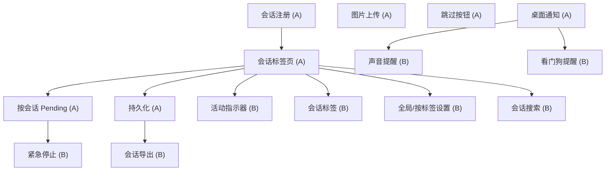

# MCP Feedback Enhanced - PRD v2.0 (中文版)

> [English Version / 英文版](./PRD.md)

## 1. 背景

MCP Feedback Enhanced 是一个 VSCode/Cursor 扩展，为 AI Agent 提供交互式反馈收集功能。它通过以下方式连接用户和 AI Agent：
- 通过 `interactive_feedback` MCP 工具提供专用的反馈收集 UI
- 允许用户在 Agent 工作时提交待处理消息（通过 Cursor Hooks）
- 自动提醒 Agent 在结束前收集反馈（通过 stop hook）

### 当前痛点

1. **多窗口冲突**：所有 Cursor 窗口共享同一个 pending 消息文件。窗口 A 的消息会被窗口 B 的 Agent 消费掉。
2. **MCP 路由失败**：多个 Cursor 窗口打开时，MCP 服务器有时会连接到错误窗口的扩展。
3. **无会话感知**：扩展没有独立会话的概念。所有消息不区分会话地显示在同一个时间线上。
4. **脆弱的 pending 格式**：pending 文件是纯文本无元数据，无法实现窗口/会话级别的隔离。

## 2. 目标

- **多窗口隔离**：每个 Cursor 窗口的 pending 消息完全独立。
- **会话感知 UI**：用户可以通过标签页查看和管理多个并发会话。
- **可靠路由**：MCP 反馈调用始终到达正确窗口的扩展。
- **稳健的 pending 投递**：pending 消息始终投递到正确窗口中正确的会话。

## 3. 用户故事

### 3.1 多窗口隔离

**作为一个打开了多个 Cursor 窗口的用户**，我希望窗口 A 中的 pending 消息只会被投递给窗口 A 的 Agent，不会影响窗口 B 的 Agent。

**验收标准**：
- 在窗口 A 提交 pending 消息不会影响窗口 B。
- 每个窗口独立维护自己的 pending 状态。
- 关闭一个窗口不会丢失其他窗口的 pending 消息。

### 3.2 会话标签页

**作为一个在同一窗口中有多个 Agent 会话的用户**，我希望每个会话显示为独立的标签页，方便在会话间切换并查看各自的历史记录。

**验收标准**：
- 当新的 Agent 会话开始时（在 Cursor 的 Composer 中），反馈面板自动出现新标签页。
- 每个标签页显示自己的消息历史（AI 摘要 + 用户反馈）。
- 标签页显示有用的标签：模型名 + 开始时间（如 "claude | 14:32"）。
- 用户可以点击标签页切换到该会话。
- 已结束的会话有视觉区分。
- 用户可以手动关闭标签页。

### 3.3 按会话隔离 Pending

**作为用户**，我希望我的 pending 消息被投递给我当前正在查看的会话（活跃标签页），而不是其他会话。

**验收标准**：
- pending 输入区域限定在活跃标签页。
- 在标签页 A 提交的 pending 消息投递给会话 A 的 Agent。
- 如果活跃标签页的会话已结束，pending 提交应被禁用或显示警告。

### 3.4 可靠的 MCP 路由

**作为一个多 Cursor 窗口的用户**，我希望 Agent 调用 `interactive_feedback` 时始终出现在正确窗口的反馈面板中。

**验收标准**：
- 窗口 A 的 Agent 调用 `interactive_feedback` 始终路由到窗口 A 的面板。
- 窗口 B 的 Agent 调用 `interactive_feedback` 始终路由到窗口 B 的面板。
- 如果目标窗口的扩展不可用，回退到浏览器。

### 3.5 Stop Hook 安全网

**作为用户**，我希望 Agent 在结束前始终征求我的反馈，避免浪费 credits。

**验收标准**：
- 当 Agent 试图不调用 `interactive_feedback` 就结束时，stop hook 提醒它。
- stop hook 不会造成无限循环（有重试硬限制）。
- 当有 pending 消息时，stop hook 将其作为 followup 消息投递给 Agent。

### 3.6 会话生命周期

**作为用户**，我希望看到会话的开始和结束，了解哪些会话仍然活跃。

**验收标准**：
- 新会话：标签页出现 "new" 指示器。
- 活跃会话（Agent 工作中）：标签页显示活动指示器。
- 已结束会话：标签页变暗/标记。
- 过期会话（来自崩溃的 Cursor 窗口）自动清理。

## 4. 功能规格

### 核心原则：`conversation_id` 是唯一真相

所有状态隔离 —— pending 消息、消息历史、标签管理、MCP 路由 —— 都以 `conversation_id` 为键。这是 Cursor 为每个会话提供的唯一稳定标识符。其他 ID（PID、CURSOR_TRACE_ID、工作区路径）不应作为主要隔离键。

### F1：按会话 Pending 消息隔离

每个会话有自己的 pending 消息存储，以 `conversation_id` 为键。

**关键行为**：
- 扩展在用户从活跃标签页提交时写入 `pending/<conversation_id>.json`。
- Hooks 在 JSON 输入中接收 `conversation_id`，直接读取 `pending/<conversation_id>.json`。
- 无歧义：`conversation_id` 是 1:1 匹配，不需要回退链。

### F2：会话标签栏

webview 面板顶部显示水平标签栏。每个标签页代表一个 Agent 会话，以 `conversation_id` 标识。

**标签页创建**：通过 `sessionStart` hook 注册检测到新会话时触发。

**标签页内容**（完全按会话隔离）：
- 此会话专属的消息历史（AI 摘要 + 用户反馈）。
- 限定于此会话的 pending 消息队列。
- 快速回复按钮。
- 自动回复设置。

**标签页标签**：`{model_short} | {HH:MM}`（如 "claude | 14:32", "gpt-4 | 15:01"）

**标签页状态**：
- **Active（活跃）**：会话运行中，标签页高亮。
- **Waiting（等待中）**：Agent 已调用 `interactive_feedback`，等待用户响应。标签页显示通知徽章。
- **Idle（空闲）**：会话存在但 Agent 未请求反馈。
- **Ended（已结束）**：检测到 `sessionEnd`。标签页变暗。

### F3：通过 Hooks 注册会话 + 上下文注入

`sessionStart` hook 是 Cursor 会话系统与扩展之间的桥梁。它做三件事：

1. **注册会话**：写入 `sessions/<conversation_id>.json` 供扩展发现。
2. **注入 conversation_id**：通过 `additional_context`，给 LLM 其具体的 `conversation_id` 值。
3. **注入 USAGE RULES**：通过 `additional_context`，告知 LLM 行为规则（必须调用 feedback、退出需用户确认等）。

**注册数据**（`sessions/<conversation_id>.json`）：
- `conversation_id`：每个会话唯一（来自 hook 输入）。
- `workspace_roots`：工作区路径（来自 hook 输入）。
- `model`：模型名（来自 hook 输入）。
- `server_pid`：匹配的扩展 PID。
- `started_at`：时间戳。

**Hook 输出**：
```json
{
  "continue": true,
  "env": {
    "MCP_FEEDBACK_SERVER_PID": "<matched_pid>"
  },
  "additional_context": "[MCP Feedback Enhanced]\nYour conversation ID: conv_abc123\nWhen calling interactive_feedback, pass conversation_id=\"conv_abc123\" (exact value, do not modify).\n\nUSAGE RULES:\n1. You MUST call interactive_feedback before ending your turn.\n2. Only when the user explicitly confirms you can stop should you end. The decision to exit is ALWAYS the user's, never yours.\n3. If you have completed your task, call interactive_feedback with a summary and ask the user for next steps."
}
```

**为什么 USAGE RULES 放在 `additional_context` 而非工具描述中**：
- 规则在会话开始时注入一次，保持工具描述简洁。
- 其他 hooks（stop、preToolUse 等）在需要时强化规则。
- 工具描述只描述工具的功能和参数。

**清理**：`sessionEnd` hook 删除注册文件。扩展也定期清理过期会话。

### F4：增强的 Stop Hook

stop hook 作为安全网确保 Agent 始终收集用户反馈。

**行为**：
- 如果此 `conversation_id` 有 pending 消息：作为 `followup_message` 投递。
- 如果没有 pending：以 `followup_message` 提醒 Agent "Please follow mcp-feedback-enhanced instructions."
- 硬循环限制（可配置，默认 3）：N 次连续 stop 触发后，静默退出防止无限循环。

所有 hooks 在注入消息时强化 USAGE RULES（如前缀 "Remember: call interactive_feedback before ending."）。

### F5：通过 `conversation_id` 路由 MCP 服务器

MCP 服务器使用 `conversation_id` 作为主要路由键，由 Agent 作为工具参数传入。

**`conversation_id` 如何到达 MCP 服务器**：
1. `sessionStart` hook 通过 `additional_context` 将具体的 `conversation_id` 值注入 LLM 上下文。
2. LLM 看到："Your conversation ID: conv_abc123. When calling interactive_feedback, pass conversation_id="conv_abc123"."
3. LLM 调用 `interactive_feedback` 时传入此值。

**`interactive_feedback` 工具参数**：
```json
{
  "summary": {
    "type": "string",
    "description": "Summary of what you have done so far."
  },
  "conversation_id": {
    "type": "string",
    "description": "Your conversation ID, provided at session start. Use the EXACT value given to you. Do NOT fabricate or modify this value."
  },
  "project_directory": {
    "type": "string",
    "description": "Optional. The project directory path."
  }
}
```

`summary` 和 `conversation_id` 为必填。`project_directory` 为可选（用于显示/回退）。

无 `agent_name` 参数 —— 标签页标签来自会话注册数据（模型 + 时间）。

**路由逻辑**（简化，基于文件发现）：
1. 如果提供了 `conversation_id`：查找 `sessions/<conversation_id>.json` → 获取 `server_pid` → 查找 `servers/<pid>.json` → 获取 port → 连接。
2. 回退：使用 MCP 服务器自身 env 中的 `CURSOR_TRACE_ID` 找到此窗口的扩展。
3. 最终兜底：浏览器回退。

**`feedback://pending` 资源**：已移除。Pending 消息完全通过 hooks 投递。

**返回值**：文本内容（用户反馈）+ 可选 images 数组。隐式在响应文本中附加 "follow instructions" 提醒。

### F6：Pending 消息投递流程

1. 用户在 webview 标签页中输入消息并提交。
2. 扩展将消息写入 `pending/<conversation_id>.json`。
3. 下一个 hook 触发（preToolUse、beforeShell、beforeMCP、subagentStart 或 stop）使用 hook 输入中的 `conversation_id` 读取 `pending/<conversation_id>.json`。
4. Hook 将消息注入 Agent 上下文并删除文件。
5. 扩展检测到文件删除，通知 webview（"pending consumed"）。
6. Webview 在活跃标签页的消息历史中显示投递确认。

**阻断行为**：
- `preToolUse`：拒绝非白名单工具（Agent 看到包含 pending 内容的原因）。
- `beforeShellExecution`：拒绝执行 + 作为 agent_message 注入。
- `beforeMCPExecution`：拒绝非反馈工具 + 注入。允许 `interactive_feedback` 但仍注入。
- `subagentStart`：拒绝子代理创建 + 注入。
- `stop`：作为 followup_message 投递（非阻断，继续 Agent 循环）。

## 5. UI/UX 设计

### 5.1 整体布局

反馈面板位于 VSCode 侧边栏（主）或底部面板（辅）。从上到下的布局：

```
┌─────────────────────────────────────┐
│  [标签栏]                       [+] │  ← 水平可滚动标签
├─────────────────────────────────────┤
│                                     │
│  [消息区域]                         │  ← 可滚动会话历史
│                                     │
│  ┌─────────────────────────────┐    │
│  │ 🤖 AI: 这是我做的...       │    │  ← AI 摘要气泡
│  └─────────────────────────────┘    │
│  ┌─────────────────────────────┐    │
│  │ 👤 你: 看起来不错           │    │  ← 用户反馈气泡
│  └─────────────────────────────┘    │
│                                     │
├─────────────────────────────────────┤
│  [Pending 队列]（有项目时显示）     │  ← 黄色高亮区域
│    "修复 bug" [✎] [✕]             │
├─────────────────────────────────────┤
│  [快速回复按钮]                     │  ← 继续 | 好的 | 修复
├─────────────────────────────────────┤
│  [文本输入区域]              [发送] │  ← 多行输入 + 智能按钮
└─────────────────────────────────────┘
```

### 5.2 标签栏

**布局**：水平排列，标签超出面板宽度时可滚动。固定高度（~32px）。

```
┌────────────────────────────────────────────┐
│ [claude|14:32 ●] [gpt-4|15:01] [+]        │
└────────────────────────────────────────────┘
```

**标签页结构**：
```
┌──────────────────────┐
│ {图标} {标签}  [×]   │
└──────────────────────┘

图标:   模型图标或彩色圆点
标签:   "{model_short} | {HH:MM}"
[×]:    关闭按钮（悬停时显示）
```

**标签示例**：
- `claude | 14:32`（Claude 模型，14:32 开始）
- `gpt-4 | 15:01`（GPT-4 模型）
- `Agent | 15:30`（未知模型或回退）

**标签视觉状态**：

| 状态 | 视觉效果 | 触发条件 |
|------|----------|----------|
| **Active（活跃）** | 加粗文字，高亮背景，底部边框强调色 | 用户点击标签 |
| **Waiting（等待中）** | 脉动通知圆点（橙/黄色） | Agent 调用了 `interactive_feedback`，等待用户响应 |
| **Running（运行中）** | 微妙的动画指示器（旋转或呼吸圆点） | Agent 工作中（hooks 正在触发） |
| **Idle（空闲）** | 普通文字，无指示器 | 无最近活动 |
| **Ended（已结束）** | 暗淡/褪色文字，斜体 | 检测到 `sessionEnd` |

**标签交互**：
- **点击**：切换到此会话（显示其历史 + pending）。
- **悬停**：显示关闭按钮 [×] 和工具提示（完整会话信息：模型、开始时间、消息数）。
- **关闭**：移除标签页。如果会话仍活跃，显示确认对话框。
- **滚动**：鼠标滚轮或拖拽水平滚动溢出的标签。

**[+] 按钮**：不用于创建会话（那在 Cursor 的 Composer 中进行）。保留用于未来使用或以编辑器模式打开反馈面板。

### 5.3 消息区域

**布局**：垂直可滚动的消息气泡列表。有新消息时自动滚动到底部。

**消息类型**：

1. **AI 摘要**（来自 `interactive_feedback` 调用）：
```
┌─────────────────────────────────────┐
│ 🤖 claude | 14:32                   │
│                                     │
│ 这是我做的：                        │
│ - 修复了登录 bug                    │
│ - 更新了测试                        │
│                                     │
│ 接下来需要我做什么？                │
└─────────────────────────────────────┘
```
- 浅背景色调（按模型颜色变化）
- Markdown 渲染
- Agent 名 + 时间戳在头部

2. **用户反馈**（用户的回复）：
```
┌─────────────────────────────────────┐
│ 👤 你 | 14:33                       │
│                                     │
│ 看起来不错，请也添加文档。          │
└─────────────────────────────────────┘
```
- 强调色背景
- 右对齐或视觉区分处理

3. **系统消息**（pending 已投递、会话事件）：
```
┌─────────────────────────────────────┐
│ ⚡ Pending 消息已投递：              │
│ > "请修复这个 bug"                  │
│                               14:34 │
└─────────────────────────────────────┘
```
- 柔和/淡化样式，居中
- 时间戳内联

4. **会话事件**（会话开始/结束）：
```
───── 会话已开始 (claude) 14:32 ─────
───── 会话已结束 15:10 ─────
```
- 水平分隔线样式，低视觉权重

**空状态**（暂无消息）：
```
┌─────────────────────────────────────┐
│                                     │
│     💬 等待 Agent 中...             │
│                                     │
│   Agent 调用 interactive_feedback   │
│   时会出现在这里。                  │
│                                     │
│   你可以在下方提交 pending 消息     │
│   随时发送反馈。                    │
│                                     │
└─────────────────────────────────────┘
```

### 5.4 Pending 队列区域

**可见性**：仅在有排队的 pending 消息时显示。位于消息区域和输入区域之间。

**布局**：
```
┌─────────────────────────────────────┐
│ 📋 Pending (2)              [清除] │
│ ┌─────────────────────────────────┐ │
│ │ "修复登录 bug"         [✎] [✕] │ │
│ │ "也检查一下测试"       [✎] [✕] │ │
│ └─────────────────────────────────┘ │
└─────────────────────────────────────┘
```

- 黄/琥珀色背景引起注意
- 每个项目显示消息文本（过长时截断）+ 编辑/删除按钮
- [✎] 编辑：将文本移回输入区域编辑
- [✕] 删除：从队列移除
- [清除]：移除所有 pending 项目（需确认）

**自动发送行为**：当 Agent 调用 `interactive_feedback`（新 AI 摘要出现时），所有排队的 pending 消息自动合并并作为回复发送。用户在消息历史中看到 "你 (自动)" 消息。

### 5.5 输入区域

**布局**：
```
┌─────────────────────────────────────┐
│ [继续] [好的] [修复] [停止]         │  ← 快速回复
├─────────────────────────────────────┤
│ 输入你的反馈...                     │
│                                     │  ← 多行文本框
│                                     │
│                          [发送 ➤]   │  ← 单个智能按钮
└─────────────────────────────────────┘
```

**单个智能发送按钮**：一个按钮，两种行为由后端自动处理：
- **Agent 等待反馈中**（会话活跃）：直接提交反馈给 Agent。按钮显示 "发送"。
- **无活跃会话**：加入 pending 队列。按钮显示 "排队"。消息将通过 hooks 注入或在 Agent 下次请求反馈时自动发送。

用户不需要思考 "发送还是排队" —— 系统根据会话状态自动决定正确的操作。

**快速回复按钮**：预填充输入框的常用回复。点击后遵循相同的智能逻辑：有活跃会话则发送，否则排队。

**按钮状态**：
| 场景 | 按钮标签 | 操作 |
|------|----------|------|
| Agent 等待反馈中 | **发送**（主样式） | 直接提交给 Agent |
| 无活跃会话 | **排队**（次要样式） | 加入 pending 队列 |
| 活跃标签页已结束 | 禁用 + 提示 "会话已结束" | 无 |

**快捷键**：
- `Enter`：智能发送（根据状态发送或排队）
- `Shift+Enter`：换行
- `Cmd/Ctrl+Enter`：强制发送（同 Enter）

### 5.6 状态栏

**位置**：面板底部或集成在标签栏区域。

```
┌─────────────────────────────────────┐
│ ● 已连接 :8765 | 2 个会话          │
└─────────────────────────────────────┘
```

**状态**：
- `● 已连接 :PORT | N 个会话` - 绿色圆点
- `○ 连接中...` - 黄色圆点，脉动
- `✕ 已断开` - 红色圆点，带重试按钮

### 5.7 响应式行为

**窄侧边栏**（< 300px 宽度）：
- 标签标签截断为模型图标 + 圆点指示器
- 快速回复按钮折叠为下拉菜单
- Pending 项目显示截断文本

**宽面板**（编辑器标签或底部面板）：
- 完整标签标签可见
- 并排消息气泡（AI 左侧，用户右侧）
- 更大的输入区域

### 5.8 交互流程

**流程 1：Agent 请求反馈**
1. Agent 调用 `interactive_feedback` 并附带摘要
2. 面板自动聚焦，对应标签页激活并显示 "等待中" 徽章
3. AI 摘要出现在消息区域
4. 如果有 pending 消息：自动立即发送，标记在历史中
5. 如果没有 pending：用户看到摘要，输入回复，点击发送
6. 标签页 "等待中" 徽章消失

**流程 2：用户在 Agent 工作时提交 pending**
1. 用户在输入区域输入，点击排队
2. Pending 项出现在 pending 队列区域（黄色）
3. 下一个 hook 触发（工具调用、shell 执行等）注入消息
4. Hook 删除 pending 文件
5. 扩展检测到删除，发送 "pending-consumed" 到 webview
6. Pending 队列清除，历史中出现系统消息："Pending 已投递"

**流程 3：新会话开始**
1. 用户在 Cursor 中打开新 Composer 并开始会话
2. `sessionStart` hook 触发，注册会话
3. 扩展检测到新会话文件
4. 标签栏出现新标签页，显示模型名 + 时间
5. 标签页初始为 "空闲" 状态
6. 当 Agent 调用 `interactive_feedback` 时，标签页切换到 "等待中"

**流程 4：多个会话**
1. 用户有 3 个会话：标签页 A（等待中）、标签页 B（空闲）、标签页 C（已结束）
2. 用户点击标签页 A → 看到 A 的历史和待处理反馈请求
3. 用户输入回复 → 发送给标签页 A 的 Agent
4. 用户点击标签页 B → 看到 B 的历史，输入区域以排队为主操作
5. 用户为标签页 B 排队消息 → pending 存储，将在 B 的 Agent 下次触发 hook 时注入

## 6. 设计决策

### D1：无标签页数量限制 + 关闭标签恢复

**决策**：不设标签页硬限制。提供管理大量标签的机制。

**标签溢出行为**：
- 标签超出面板宽度时水平滚动。
- 溢出时边缘出现左/右滚动箭头。
- 右端出现 "..." 溢出菜单按钮，列出所有标签（快速跳转）。

**关闭标签恢复**：
- 关闭标签页不销毁数据（历史已持久化）。
- 溢出菜单底部包含 "最近关闭" 部分。
- 点击最近关闭的标签可重新打开并恢复完整历史。
- 最近关闭标签有上限（如保留最近 20 个）。
- 右键标签栏显示上下文菜单："重新打开关闭的标签页"（类似浏览器 Ctrl+Shift+T）。
- 替代方案：关闭后标签变为 "已归档"，有视觉区分。已归档标签折叠到溢出菜单但不删除。

**标签自动清理**：
- "已结束" 状态超过 24 小时的标签自动归档到溢出菜单。
- 用户可通过上下文菜单手动 "关闭所有已结束"。

### D2：跨重启标签状态持久化

**决策**：标签在 Cursor 重启后保留。

**每个会话持久化数据**（存储在 `~/.config/mcp-feedback-enhanced/conversations/<conversation_id>.json`）：
- `conversation_id`
- `model`
- `started_at`
- `ended_at`（仍活跃时为 null）
- `label`（从模型 + 时间计算）
- `messages[]`（AI 摘要 + 用户反馈）
- `pending_queue[]`（排队的 pending 消息）
- `server_pid`（最后已知的扩展 PID，重启时重新绑定）

**重启时**：
1. 扩展读取所有 `conversations/*.json` 文件。
2. 通过匹配 `workspace_roots` 将会话重新绑定到当前窗口。
3. 恢复标签页。活跃会话标记为 "stale"（Agent 可能已停止）。
4. 如果同一 `conversation_id` 再次触发 `sessionStart`，标签状态刷新。

**过期检测**：
- `server_pid` 不再存在的持久化标签标记为 "stale"（变暗，带刷新图标）。
- 如果 Agent 重新连接（同一 `conversation_id` 的新会话），标签重新激活。

### D3：按会话 Pending（完全标签隔离）

**决策**：pending 消息按会话隔离，而非按窗口。

这是相较之前方案的关键架构变更。每个标签页（会话）是完全独立的单元，拥有自己的：
- 消息历史
- Pending 消息队列
- 状态机（idle / running / waiting / ended）

**Pending 文件结构**：
```
~/.config/mcp-feedback-enhanced/
  pending/
    <conversation_id>.json    ← 每个会话一个文件
```

**Pending 文件格式**：
```json
{
  "conversation_id": "conv_abc",
  "server_pid": 1234,
  "comments": ["修复 bug", "也检查测试"],
  "timestamp": 1707500000000
}
```

**Hooks 如何知道读取哪个会话的 pending**：
- Hooks 在 JSON 输入中收到 `conversation_id`（来自 Cursor）。
- Hook 直接读取 `pending/<conversation_id>.json`。
- 不需要 `MCP_FEEDBACK_SERVER_PID` 环境变量来限定 pending 范围；`conversation_id` 是天然的键。

**Webview 如何为特定会话写入 pending**：
1. 用户在活跃标签页的输入框中输入并点击排队。
2. Webview 发送 `{ type: 'queue-pending', conversation_id: 'conv_abc', text: '...' }` 到扩展。
3. 扩展写入/更新 `pending/<conversation_id>.json`。

**优势**：
- 零跨会话干扰（即使在同一窗口内）。
- Hooks 天然拥有 `conversation_id` —— pending 路由不需要环境变量。
- 状态隔离减少 bug：每个标签页是自包含的迷你应用。
- `MCP_FEEDBACK_SERVER_PID` 仍由 `sessionStart` 设置用于 MCP 路由，但 pending 以 `conversation_id` 为键。

**边界情况**：用户在 `sessionStart` 触发前在标签页中排队 pending（如标签页从持久化恢复）。pending 文件以持久化的 `conversation_id` 写入。当 hook 最终以该 `conversation_id` 触发时，会找到文件。

### D4：后台 Agent

**决策**：后台 Agent 获得具有独特视觉处理的标签页，默认开启自动回复。

Cursor 支持 hook 输入中的 `is_background_agent` 标志。后台 Agent 是自主的，通常不需要用户交互。

**标签视觉**：
```
┌──────────────────────────┐
│ 🔄 claude (bg) | 14:32  │   ← "bg" 标签 + 独特图标
└──────────────────────────┘
```

- 后台标签有独特的颜色/样式（如淡紫色调）。
- 标签标签包含 "(bg)" 以区分交互式会话。
- 后台标签分组到标签栏右侧（普通标签之后）。

**后台 Agent 的自动回复**：
- 当后台 Agent 调用 `interactive_feedback` 时，使用配置的自动回复文本自动生成回复。
- 如果未配置自动回复，标签页像普通标签一样显示 "等待中" 徽章。
- 用户可以点击后台标签手动回复来覆盖自动回复。

**默认自动回复行为**：
- 后台 Agent 标签默认开启自动回复。
- 自动回复文本默认为 "Continue"（可按标签或全局配置）。
- 自动回复触发时，出现系统消息："自动回复：Continue"。

## 7. 数据架构总结

### 按会话数据模型

每个会话是一个完全自包含的单元。`conversation_id` 是通用键。

```
~/.config/mcp-feedback-enhanced/
  sessions/
    <conversation_id>.json      ← 会话注册（来自 sessionStart hook）
  pending/
    <conversation_id>.json      ← Pending 消息（来自 webview 经扩展）
  conversations/
    <conversation_id>.json      ← 持久化标签状态（历史、设置）
  servers/
    <pid>.json                  ← 扩展实例注册表（不变）
```

**数据流**：
```
Webview 标签页 (conv_abc) → 扩展 → pending/conv_abc.json → Hook (conv_abc) → Agent
                                                                                  ↓
Agent → interactive_feedback(conversation_id=conv_abc) → MCP 服务器 → 扩展 → 标签页
```

### 标签页生命周期状态机

```
创建 → 空闲 → 运行中 → 等待中 → (用户响应) → 运行中 → ... → 已结束 → 已归档
                 ↑                                                          ↓
                 └─── (sessionStart 再次触发) ──── 重新激活 ────────────────┘
```

**标签页状态转换**：
| 从 | 到 | 触发条件 |
|----|----|----------|
| (无) | 已创建 | 检测到 `sessionStart` 或从持久化恢复 |
| 已创建 | 空闲 | 初始状态 |
| 空闲 | 运行中 | 此会话的 hook 触发 |
| 运行中 | 等待中 | 使用此 conversation_id 调用 `interactive_feedback` |
| 等待中 | 运行中 | 用户提交反馈 |
| 运行中 | 已结束 | 检测到 `sessionEnd` 或 30 分钟无活动 |
| 已结束 | 已归档 | 24 小时后自动清理或用户关闭标签 |
| 已归档 | 重新激活 | 同一 `conversation_id` sessionStart 再次触发 |

## 8. 功能脑暴

### 8.1 现有功能审计

#### 保留并改进

| 功能 | 当前状态 | v2.0 计划 |
|------|----------|-----------|
| 核心反馈流（MCP -> 扩展 -> Webview） | 正常工作 | 通过按会话隔离改进路由 |
| Pending 消息队列 | 正常工作（按窗口） | 升级为按会话 |
| Cursor Hooks 注入（6 个 hooks） | 正常工作（无隔离） | 添加 conversation_id 感知 |
| 自动回复 | 正常工作 | 按标签页隔离，改进后台 Agent 支持 |
| 快速回复按钮 | 正常工作 | 保留，按标签页隔离 |
| 规则系统（附加到反馈） | 正常工作 | 保留，改进按标签页规则 |
| 浏览器回退 | 正常工作 | 保持不变 |
| 历史记录（SQLite，按 agent_name） | 正常工作 | 迁移到按 conversation_id |
| 服务器发现（servers/*.json） | 正常工作 | 保留，改进过期清理 |
| 多面板（侧边栏、底部、编辑器） | 正常工作 | 保留，所有面板共享标签状态 |
| 开发热重载 | 正常工作 | 保留 |
| MCP 资源 `feedback://pending` | 正常工作 | 按会话限定 |
| `get_system_info` 工具 | 正常工作 | 保留 |
| 消息 Markdown 渲染 | 正常工作 | 保留 |
| 搜索/过滤消息 | 正常工作 | 保留，按标签页限定 |
| 设置面板（自动回复、规则、快速回复） | 正常工作 | 拆分为按标签页 + 全局设置 |

#### 修复（损坏/部分）

| 功能 | 问题 | v2.0 计划 |
|------|------|-----------|
| 图片处理 | 后端支持图片但 webview 发送 `images: []`；无上传 UI | 添加图片上传按钮 + 剪贴板粘贴 |
| 规则同步到扩展 | `onRulesUpdate` 回调存在但未连接 | 连接或移除死代码 |
| `sessions_list` WS 消息 | 服务器发送但 webview 仅记录日志 | 为新标签栏提供数据 |
| `session_loaded` / `load_session` | 后端支持但 UI 未触发 | 为标签切换启用 |
| `dismissed` 反馈回复 | 回复中支持但无跳过 UI | 添加 "跳过/忽略" 按钮 |

#### 移除（死代码）

| 功能 | 原因 |
|------|------|
| 旧 `tabBar` DOM 引用 | 死代码：`document.getElementById('tabBar')` 但 HTML 中无此元素 |
| `suggest-expand` 处理程序 | Provider 中有处理程序但 webview 从不发送 |
| localStorage 中的 PENDING_CACHE_KEY | 将被服务端按会话持久化替代 |

### 8.2 待考虑的新功能

#### 优先级 A：v2.0 必需（重写的一部分）

| 功能 | 描述 | 理由 |
|------|------|------|
| **会话标签页** | 按 conversation_id 的标签栏 | 重写核心 |
| **按会话 Pending** | pending 限定到 conversation_id | 消除跨会话干扰 |
| **按会话持久化** | 会话重启后保留 | 用户要求 |
| **sessionStart 会话注册** | 搭建 hooks 到扩展的桥梁用于标签创建 | 标签生命周期所需 |
| **图片上传 UI** | 上传按钮 + 剪贴板粘贴 (Ctrl+V) | 现有后端支持被浪费 |
| **跳过/忽略按钮** | 跳过反馈请求不回复 | 有时 Agent 请求不必要的反馈；跳过释放会话 |
| **桌面通知** | Agent 请求反馈时 OS 通知 | 用户在其他应用工作时错过反馈请求 |

#### 优先级 B：高价值，中等工作量

| 功能 | 描述 | 理由 |
|------|------|------|
| **紧急停止按钮** | 一键终止 Agent 会话。发送特殊 pending 消息如 "立即停止"，hooks 注入为硬停止。 | 用户有时需要紧急停止失控 Agent |
| **Agent 活动指示器** | 基于 hook 活动显示 Agent 当前操作（如 "运行 shell 命令..."、"调用工具 X..."）。 | 用户在反馈请求之间无法了解 Agent 进度 |
| **会话导出** | 导出会话为 Markdown 或 JSON。用于文档、bug 报告或分享。 | 会话包含有价值的上下文，目前困在扩展中 |
| **声音提醒** | 请求反馈时播放可配置的通知声音。可按标签页或全局切换。 | 专注时视觉通知容易错过 |
| **会话标签** | 用户自定义的标签页标签（如 "Auth 重构"、"修复登录 bug"），附加在自动生成的模型+时间标签上。 | 多标签时模型+时间描述不够 |
| **全局设置 vs 按标签设置** | 拆分设置为全局（应用所有标签）和按标签（自动回复文本、规则）。新标签继承全局设置。 | 不同会话可能需要不同策略 |
| **看门狗/超时提醒** | Agent 等待反馈超过 N 分钟时，显示醒目提醒或重新聚焦面板。按标签可配置。 | 用户有时忘记有等待中的 Agent |
| **会话搜索** | 跨所有会话搜索（消息、Agent 名、时间戳）。 | 20+ 标签时难以找到特定过去会话 |

#### 优先级 C：锦上添花，未来考虑

| 功能 | 描述 | 理由 |
|------|------|------|
| **条件自动回复规则** | 基于 Agent 摘要中的模式自动回复（如 "包含 '测试通过' 时回复 '继续'"）。 | 高级用户可自动化重复反馈 |
| **费用/Token 估算** | 基于模型和消息数估算每会话 credits。在标签提示或会话页脚显示。 | 用户需要费用感知 |
| **语音输入** | Web Speech API 口述反馈替代打字。输入区域旁的切换按钮。 | 长反馈更快，无障碍支持 |
| **上下文附件** | 将代码片段或文件引用附加到反馈。输入旁 "+" 按钮打开文件选择或粘贴带语法高亮的代码。 | 反馈有时需要引用特定代码 |
| **Hook 检查器（调试面板）** | 开发者面向面板，显示 hook 执行记录、耗时和注入内容。从设置切换。 | Hook 行为调试目前不透明 |
| **跨窗口仪表盘** | 全局概览面板，显示所有 Cursor 窗口的活跃会话。任何窗口可访问。 | 多窗口时难以了解各处运行情况 |
| **反馈模板** | 保存常用多行反馈为命名模板。比快速回复更长更结构化。 | 跨会话重复相同复杂指令 |
| **标签页置顶** | 置顶标签防止自动归档。已结束的置顶标签保留在标签栏。 | 重要会话不应自动归档 |
| **MCP 健康检查** | 验证 MCP 服务器 + 扩展连通性的按钮。显示诊断信息。 | 排查连接问题 |
| **深度链接/URL scheme** | `vscode://mcp-feedback/conversation/conv_abc` 跳转到特定会话。 | 从外部工具快速导航 |

### 8.3 功能依赖关系



## 9. 范围外（v2.0）

- 跨窗口消息转发
- 远程/SSH 工作区支持
- 团队级别 hooks 分发
- 标签页拖拽排序
- 自定义标签颜色/图标
- Slack/Discord 集成